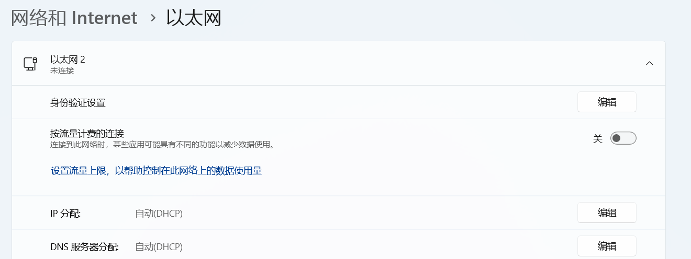
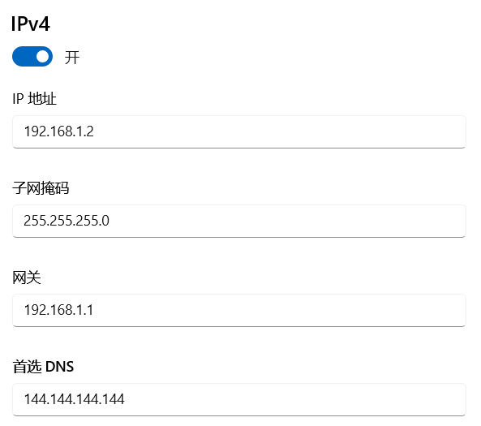
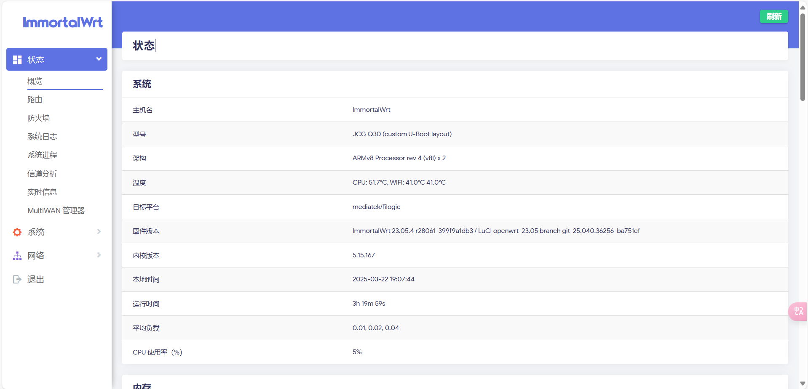
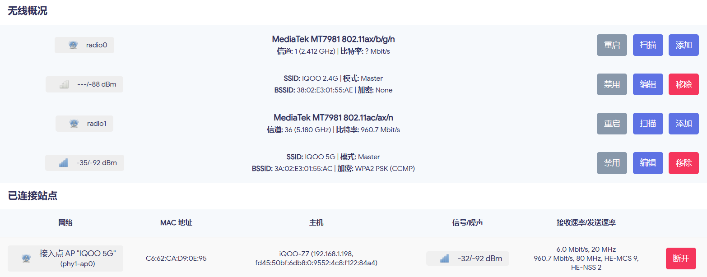
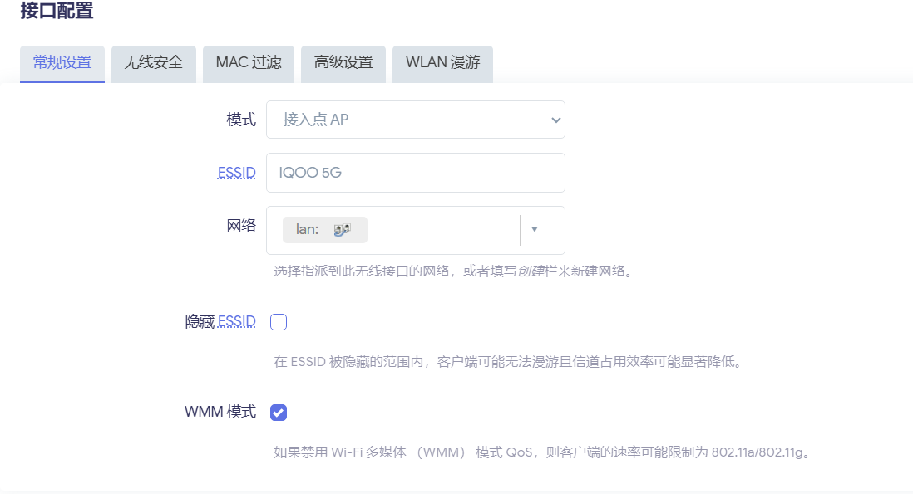
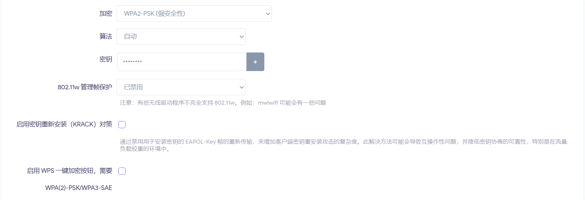

# 关于云南财经大学（安宁）通过路由器发散信号

## 前言

因为云财经大学的校园网主要是设备限制，而且69元才50M的速度，还总是断连，虽然有无感认证系统，但是跟没用一样，每次连接WiFi都需要重新登录账号密码。

所以我经过一系列探究之后，通过路由器连接宿舍网线的方式来发散WIFI信号。可以无视设备限制

我主要还想搞一个通过虚拟网口macvlan与其他舍友的校园网账号密码来做网速叠加，可是好多方法都尝试了还是做不到，会遇到各种各样的问题。如果谁会请在议题发一下方法让我学一下。

## 材料准备方面

我用的是JCG Q30 PRO 512MB的路由器（咸鱼上面90块钱拿下）其他能够刷OpenWrt或者ImmortalWrt的路由器也可以，一根千兆网线2-3米（10块左右），一根短一点的网线，拼多多1块多就能买（百兆千兆都行，主要是救路由器进不了系统并且发不出信号时用）。

## 步骤

**第一步** 

刷入Uboot（每一个路由器都不一样，具体的刷入方法网上搜索你自己买的路由器怎么刷Uboot系统），这一步是防止刷入固件时刷入了不对应的固件导致进不了设备，如果遇到这个情况最好的办法是按路由器的RESET键重置路由器到正常亮灯后，用备用的短网线连接路由器然后再连接电脑的网口
同时刷入OpenWrt固件或者ImmortalWrt固件也能用这个方法

IP分配手动设置

可以这样设置了之后，在浏览器的网址栏输入网关就进去Uboot系统了，然后再导入可以用的固件。

**第二步** 

刷入OpenWrt或者ImmortalWrt固件

[OpenWrt]([OpenWrt Firmware Selector](https://firmware-selector.openwrt.org/))  [ImmortalWrt]([ImmortalWrt Firmware Selector](https://firmware-selector.immortalwrt.org/))

左边输入路由器名称，右边是版本选择了后下载，具体下载哪个只能一个个试试。

刷入了之后界面是这样的，我这里是安装了argon的美化界面可以在网上搜索其他美化界面

**第三步** 

把网线插入宿舍墙上的网口然后一端接在路由器的wan口上面，然后进入路由器系统界面查看<mark>网络->接口</mark>处的wan口是不是DHCP客户端的协议，如果不是就改成这样，因为学校采用的是网页认证方式，学校机房的才是拨号方式。

**第四步** **这是最重要的一步**

在<mark>网络->无线</mark> 处查看WiFi设置 

主要看信道那里，通常路由器已经把这2个信号给出来了2.4G与5G信号。

下面有SSID这个就是wifi信号，如果没有给出就点击添加，有了就点编辑来设置WiFi信号

工作频率那里主要是

1、n：n对应的是支持802.11n协议，也就是WiFi4，速率多为150M、300M、450M，并且只支持2.4G频段。

2、ac：ac对应的是支持802.11ac协议，也被称作WiFi5，速率多为600M至1900M之间，支持2.4G、5.8G两个频段。

3、ax：ax对应的是支持802.11ax协议也就是支持WiFi6，速率多为1800M至7200M之间，支持2.4G、5.8G两个频段，部分路由器拥有一个频道管理功能，支持三频。

信道可以根据自己设置，2.4G最好在1号信道，通道宽度2.4G设置为20MHz，5G为80MHz

160MHz需要手机与路由器支持，并且国内大部分地区不可用，所以设置为80MHz

在这里可以设置一些WiFi名字与属性主要是ESSID，这个就是发散出来的WiFi信号的名字，隐藏ESSID就可以把WIFI隐藏了。

无线安全就可以设置加密方式与密码了。

## 剩下的补充（降低延迟）

在<mark>系统->软件包</mark>里配置OPKG的最下面那一个框可以配置国内镜像。然后下载软件与更新软件。之后下载一个mwan3的负载均衡插件，主要是用来分配多wan口的均匀负载，但是下载之后我发现可以降低游戏延迟。王者里面30-40的MS可以降低到20多MS。
